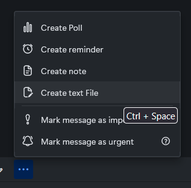
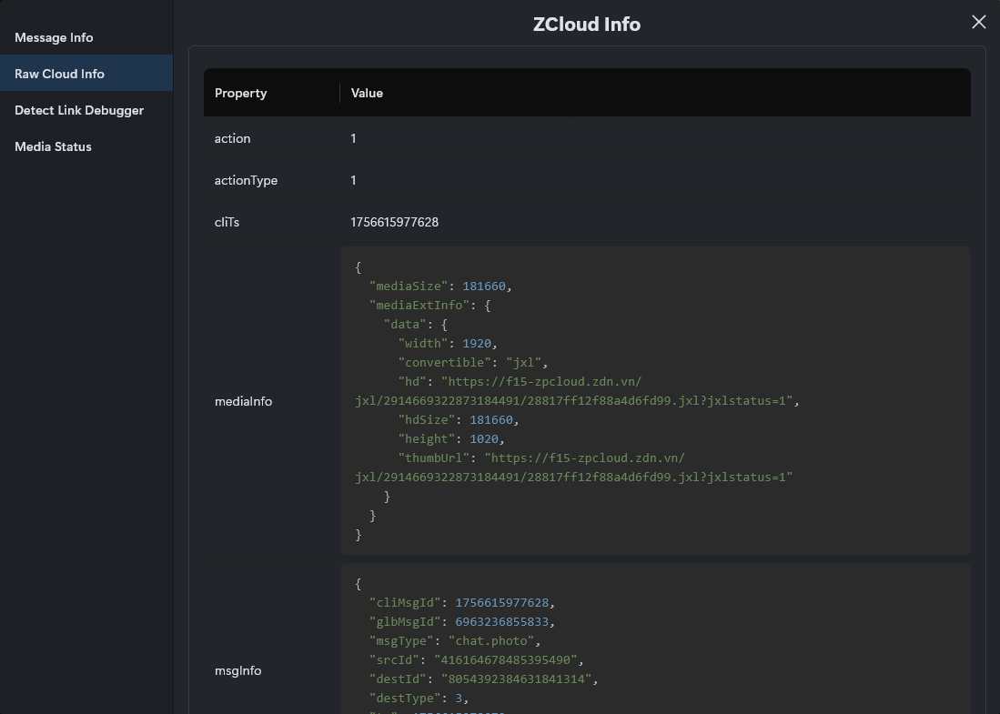

# Zalo-F12
Bộ sưu tập code Javascript "paste" vào DevTools để thay đổi cách hoạt động của Zalo Web/PC.

## Nếu bạn dùng Zalo PC:
Dùng lệnh sau để kích hoạt Remote Debugger trên ứng dụng Zalo PC:
- CMD:
    ```
    %localappdata%\Programs\Zalo\Zalo.exe --remote-debugging-port=8315 --remote-allow-origins=*
    ```
- Powershell:
    ```
    & "$env:localappdata\Programs\Zalo\Zalo.exe" --remote-debugging-port=8315 --remote-allow-origins=*
    ```

Sau đó mở trình duyệt và truy cập `http://localhost:8315`. Bạn sẽ thấy 3 mục như sau:


Chọn link đầu tiên để mở DevTools trên cửa sổ chính của Zalo PC.

## Cách hoạt động

Ứng dụng Zalo PC và phiên bản web đều dùng Electron, React và Webpack để chạy. Mã nguồn của 2 phiên bản này khá giống nhau (có thể là chung một mã nguồn) nên các đoạn code dưới đây đều dùng được cho cả 2 phiên bản.

Gần như mọi chức năng của Zalo đều có thể được truy cập thông qua mảng `window.webpackJsonp`. Mảng này chứa tất cả các module để Zalo hoạt động. Mỗi module có một ID riêng biệt và có thể được truy cập thông qua đoạn mã sau:

```js
window.webpackJsonp.push([[Math.random()],{},[["id module"]]])
```

ID của các module có thể được tìm thấy rải rác trong tệp `zalo-chat-static.zadn.vn/v1/lazy/default-embed-web-startup... .js` và thường có độ dài 4 ký tự.

```js
"DOj/": function(t, n, a) { //  <-- ID webpack DOj/
    "use strict";
    a.r(n), a.d(n, "showContextMenu", (function() {
        return ne
    }));
    var s = a("VTBJ"),  // <-- ID webpack VTBJ
        i = a("jDHv"),  // <-- ID webpack jDHv
        o = a("NDmK"),  // etc.
        r = a("1pet"),  // ...
        l = a("6uTC"),  // ...
    ...
},
...
```

Nội dung của các module có thể chứa các hàm, biến, class, v.v.

```
window.webpackJsonp.push([[Math.random()],{},[["NDmK"]]])
> Object { CONFIG_DOMAIN: Getter, ChangeToDevDomain: Getter, ChangeDomain: Getter, mergeConfig: Getter, getPVConfigs: Getter, mergePhotoViewerConfig: Getter, "$AppConfig": Getter, default: {…}, … }

window.webpackJsonp.push([[Math.random()],{},[["fBUP"]]])
> Object { default: class ge, … }
```

## Script
Các bạn có thể xem mã nguồn và cài các userscript tại thư mục [Userscripts](./Userscripts/).

## Code
Ok giờ chúng ta sẽ đến phần "copy paste" vào DevTools.

### 1. Mã hoá/giải mã dữ liệu
Zalo mã hoá gần như tất cả dữ liệu gửi đi và nhận về và mỗi phiên đăng nhập đều có khoá giải mã riêng. Ta có thể tận dụng hàm mã hoá/giải mã sẵn của Zalo để làm việc này mà không cần biết khoá.

```js
window.webpackJsonp.push([[Math.random()], {}, [["z0WU"]]]).default.decodeAES("nội dung bị mã hoá")

window.webpackJsonp.push([[Math.random()], {}, [["z0WU"]]]).default.encodeAES("nội dung cần mã hoá")
```

```
window.webpackJsonp.push([[Math.random()], {}, [["z0WU"]]]).default.decodeAES("lqwMxeU86kgh6jcanndGmJjzJHsqu6B8v1kFI9p9/381UGcffjBS8HFWkrNBWbZPmIz/k3v+YQKUIgD4rsycfvKZ/jxBYqvN/r0T+ZASzQs=") 
> '{"error_code":0,"error_message":"Successful.","data":{"status":true}}'


window.webpackJsonp.push([[Math.random()], {}, [["z0WU"]]]).default.encodeAES('{"error_code":0,"error_message":"Successful.","data":{"status":false}}') 
> "lqwMxeU86kgh6jcanndGmJjzJHsqu6B8v1kFI9p9/381UGcffjBS8HFWkrNBWbZPkvvnCrKosWFgk2aesrVYmh26K6SKxKi88fB0yLNFh2M=" 
```

### 2. Lấy thông tin người dùng hiện tại

```js
await window.webpackJsonp.push([[Math.random()],{},[["XS0u"]]]).default.getMe()
```


### 3. Lấy danh sách nhóm đã tham gia
```js
window.webpackJsonp.push([[Math.random()],{},[["Gm1y"]]]).default.getGroupsListSync() 
```


### 4. Lấy danh sách bạn bè

```js
await window.webpackJsonp.push([[Math.random()],{},[["XS0u"]]]).default.getFriends() 
```


### 5. Gửi tin nhắn văn bản đến một chủ đề (người dùng/nhóm)

```js
let isGroup = false;
let ttl = 0;
window.webpackJsonp.push([[Math.random()],{},[["fBUP"]]]).default.sendZText("id", "tin nhắn", isGroup, Date.now(), {count: 3, lowPriority: false, timeout: 1, timestamp: Date.now()}, {shouldParseLinkOrContact: false, ttl: ttl})
```

- id: id người dùng/nhóm (id nhóm được prefix bằng chữ 'g')
- isGroup: chủ đề mục tiêu có phải là nhóm không
- ttl: thời gian tin nhắn tồn tại, 0 là không biến mất


### 6. Lấy lịch sử tin nhắn 

```js

let count = 50;
window.webpackJsonp.push([[Math.random()], {}, [["z0WU"]]]).default.decodeAES(
	(await window.webpackJsonp.push([[Math.random()],{},[["fBUP"]]]).default.getHistoryMessage('id', count)).data.data
)

```

Bạn có thể dùng `JSON.parse` để chuyển đổi chuỗi JSON thành đối tượng cho dễ nhìn.


### 7. Bật/tắt chế độ xem ảnh trong cửa sổ popup

```js
// Bật là 1, tắt là 0
window.webpackJsonp.push([[Math.random()],{},[["NDmK"]]]).default.enable_photoviewer_popup = 1
```


### 8. Kích hoạt chức năng sticker Guggy

```js
window.webpackJsonp.push([[Math.random()],{},[["NDmK"]]]).default.enable_guggy = 1
```


### 9. Kích hoạt embed YouTube và SoundCloud

```js
// Kích hoạt embed YouTube
window.webpackJsonp.push([[Math.random()],{},[["NDmK"]]]).default.embed_pop.enable_youtube = 1 
// Kích hoạt embed SoundCloud
window.webpackJsonp.push([[Math.random()],{},[["NDmK"]]]).default.embed_pop.enable_soundcloud = 1 
```


### 10. Kích hoạt chức năng tạo và gửi tệp văn bản 

```js
window.webpackJsonp.push([[Math.random()],{},[["NDmK"]]]).default.tfe.enable_edit = 1 
```




### 11. Hiện tuỳ chọn mã hoá đầu cuối
__*Chức năng mã hoá đầu cuối hiện không thể kích hoạt được.*__

```js
let e2ee = window.webpackJsonp.push([[Math.random()],{},[["NDmK"]]]).default.e2ee;
e2ee.enable_group = true;
e2ee.invisible = false;
e2ee.default_11_banner.enable = true;
```


### 12. Kích hoạt chế độ nhà phát triển

```js
window.webpackJsonp.push([[Math.random()],{},[["NDmK"]]]).default.adminMode = 1 
```


 



### 13. Tạo thông báo trên màn hình 

```js
let delay = 10000;
window.webpackJsonp.push([[Math.random()],{},[["6uTC"]]]).default.createMessage("nội dung", delay)
```


### 14. Tạo thông báo góc dưới bên trái

```js
window.webpackJsonp.push([[Math.random()],{},[["6uTC"]]]).default.createMessageCustom({
    type: 2,    // 1 là cảnh báo, 2 là thông tin, 3 là lỗi, 4 là thành công
    title: 'tiêu đề',
	description: 'nội dung',
    duration: 10000,
    buttons: {  // Có thể có hoặc không
        primary: {
            textKey: "OK",
            onClick: () => {}   // Sự kiện nút bấm
        }
    }
})
```


### 15. Tạo thông báo với biểu tượng

```js
let types = window.webpackJsonp.push([[Math.random()],{},[["Vp9m"]]]).TOAST_TYPE;
let windowId = '1'; // 1 là id cửa sổ chính 
window.webpackJsonp.push([[Math.random()],{},[["Vp9m"]]]).ZToastManagerHolder.getZToastManagerByWindowId(id).show({
    noBackground: true, // Không làm mờ toàn bộ màn hình bằng nền
    darkmode: false,    // Hiện thông báo trong chế độ tối bất kể chủ đề hiện tại
    textKey: 'nội dung thông báo',
    type: types.INFO,   // Loại thông báo 
    duration: 5000      // Thời gian hiện thông báo
})
```

 